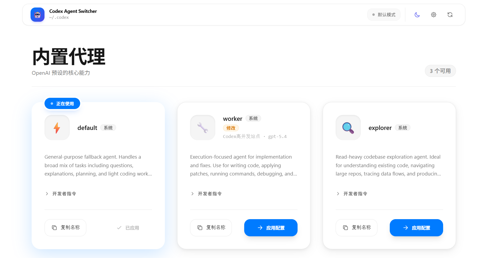

# Codex Agent Switcher

一个面向 [OpenAI Codex CLI](https://github.com/openai/codex) 的本地 Web UI，用来查看、编辑和切换 agent 配置文件。

A local web UI for managing, editing, and switching Codex CLI agent configs.

如果你主要在 Codex desktop app 里工作，这个工具会更有意义。

在 CLI 里，熟悉配置的人通常可以直接打开 `~/.codex/config.toml` 和 `~/.codex/agents/*.toml` 手改；但在桌面 app 里，很多用户并不会频繁接触这些底层文件。真正麻烦的不是“改一个值”，而是要先知道配置文件在哪、哪些字段能改、内置 agent 应该怎么覆盖、项目级 agent 放在哪，以及改动之后是否会把已有的高级配置一起覆盖掉。

Codex Agent Switcher 的作用，就是把这些原本分散在 TOML 文件里的操作收拢成一个本地页面，让你在不离开 app 工作流太远的情况下完成配置管理。

## Screenshot



## Why

Codex 的 agent 配置本质上是 TOML 文件。直接手改当然可行，但在下面这些场景里并不高效：

- 你想快速切换 `default` / `worker` / `explorer`
- 你想覆盖内置 agent，但又不想手写完整 TOML
- 你想编辑已有 agent，同时保留未在 UI 中显式展示的高级字段
- 你想同时查看全局 agent 配置、个人 agent 库和项目级 `.codex/agents/`
- 你主要用的是 Codex desktop app，不想为了改配置反复跳到文件系统和终端里手工操作

Codex Agent Switcher 的目标就是把这些操作变成一个本地页面，而不是一堆分散的文件编辑。

## What It Does

- 可视化展示内置 agent：`default`、`worker`、`explorer`
- 创建、编辑、删除个人 agent：`~/.codex/agents/*.toml`
- 支持加载项目级 agent：`<project>/.codex/agents/*.toml`
- 支持编辑常用字段：
  `model`、`model_provider`、`model_reasoning_effort`、`sandbox_mode`、`nickname_candidates`、`mcp_servers`
- 支持 HTTP / stdio 两类常见 MCP server 配置
- 编辑已有 agent 时保留未展示的高级字段，例如 `skills.config` 或更完整的 `mcp_servers` 配置
- 可视化编辑 `[agents]` 全局配置：
  `max_threads`、`max_depth`、`job_max_runtime_seconds`

## What It Does Not Do

- 它不替代 Codex 会话内的 `/agent`
  `/agent` 仍然是查看和管理当前会话里运行中的子代理的方式
- 它主要修改的是配置文件，而不是直接接管一个已经在运行的 Codex 进程
- 它可以和 Codex desktop app 一起使用
  但修改的是底层配置文件，通常对新开的会话生效，不保证立即热更新当前正在运行的会话

## Quick Start

### Requirements

- Node.js >= 18
- 已安装 OpenAI Codex CLI
- 本机存在 Codex 配置目录，默认是 `~/.codex`

### Install

```bash
git clone https://github.com/your-name/codex-agent-switcher.git
cd codex-agent-switcher
npm run setup
```

### Run

```bash
# Production mode
npm start
```

默认访问地址：

- App: `http://localhost:3737`
- 生产模式启动后会自动在默认浏览器打开这个地址

### Development

```bash
npm run dev
```

开发模式下：

- Frontend: `http://localhost:5173`
- Backend API: `http://localhost:3737`

## Environment Variables

复制 `.env.example` 为 `.env`，按需修改：

| Variable | Default | Description |
|---|---|---|
| `CODEX_DIR` | `~/.codex` | Codex 配置目录 |
| `PORT` | `3737` | 后端服务端口 |
| `APP_URL` | `http://localhost:3737` | 自动打开浏览器时使用的地址 |
| `AUTO_OPEN_BROWSER` | `true` | 生产模式启动后是否自动打开浏览器，设为 `false` 可关闭 |

```bash
cp .env.example .env
```

Windows 用户也可以直接手动创建 `.env`。

## Config Files

这个工具会读取和写入下面这些文件：

```text
~/.codex/
├── config.toml
└── agents/
    ├── worker.toml
    └── my-agent.toml
```

项目级 agent 存放在：

```text
<project>/.codex/agents/
```

### Notes

- 选择某个 agent 作为默认值时，工具会修改 `config.toml` 里的 `agent` 字段
- 选择 `default` 时，会移除该字段，回到全局默认状态
- UI 会优先显示 `~/.codex` 这种 home-relative 路径，避免在截图里暴露本机用户名

## Example Agent File

```toml
name = "my-agent"
description = "What this agent does and when to use it."
developer_instructions = """
You are a specialized agent. Your job is to...
"""

model = "gpt-5.4"
model_reasoning_effort = "high"   # minimal / low / medium / high / xhigh
sandbox_mode = "read-only"        # read-only / workspace-write / danger-full-access
nickname_candidates = ["Atlas", "Delta", "Echo"]

[mcp_servers.myServer]
url = "https://example.com/mcp"
```

如果原始 agent 文件中还有额外字段，例如：

- `skills.config`
- 更复杂的 `mcp_servers.*`
- 其他 Codex 支持的配置键

通过 UI 编辑后，这些字段会尽量被保留，而不是被整份覆盖掉。

## Tech Stack

- Backend: Node.js + Express + [@iarna/toml](https://github.com/iarna/iarna-toml)
- Frontend: React 18 + Vite + Tailwind CSS

## Repository Description

如果你要把这个项目发布到 GitHub，仓库描述可以直接用：

`Local web UI for managing, editing, and switching Codex CLI agent configs.`

## License

MIT
